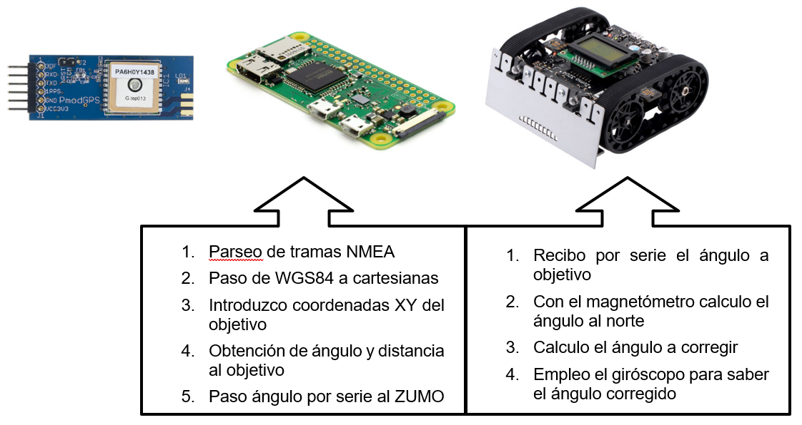
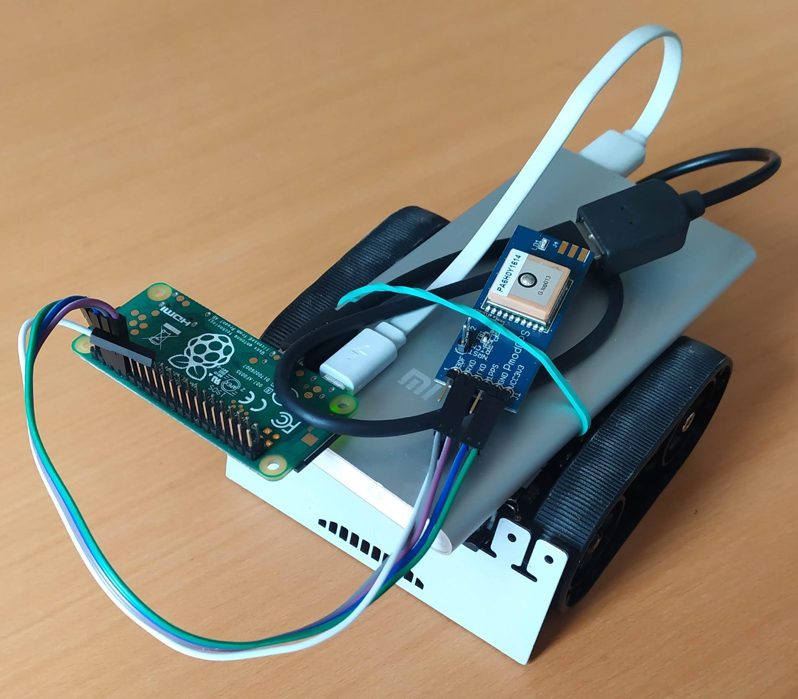

# GPS-guided-robot
Control of the ZUMO32U4 robot direction using GPS

The raspberry parses NMEA data, calculates the vector to the target and sends the angle to the robot.

The ZUMO32U4 should be switched on pointing to north and uses gyroscope to know the rotated angle.

The electronic compass cannot be used due to interference with motors. Even tough, the MagSensor library developed is uploaded in case that future pcb designs change the position of the sensor.

Robot developed for the subject "Mobile Robots" at the University of Granada Master's Degree in Industrial Electronics.
https://masteres.ugr.es/electronicaindustrial/

Contents:
- GPS-robot: project folder for the ZUMO32U, can be programmed with Arduino IDE.
- GPS-rpi.py: python3 program running on the raspberry.
